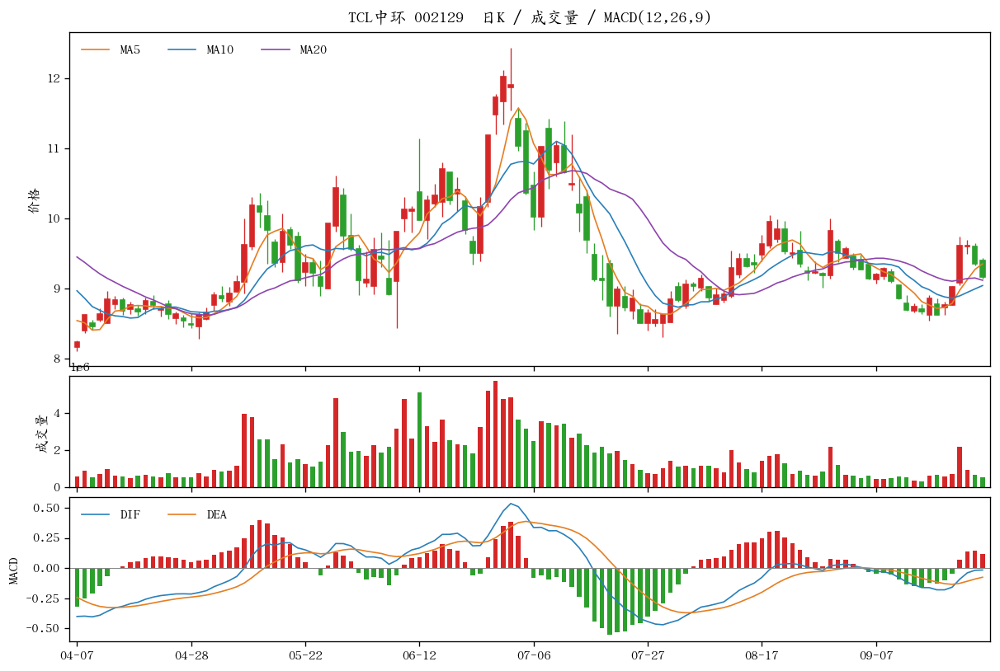
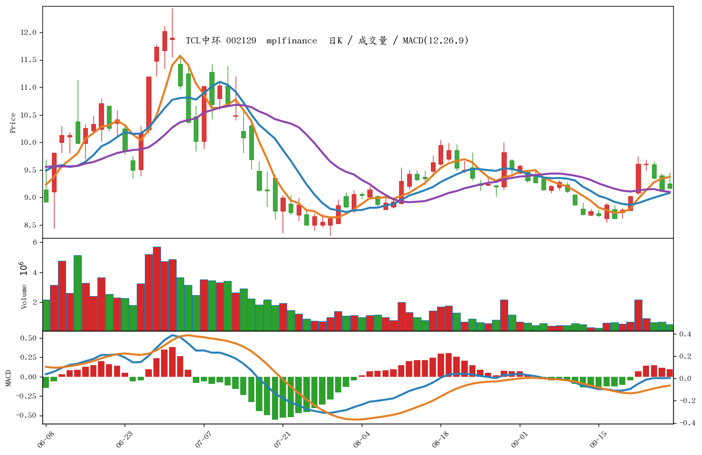

# 04 — 用 matplotlib 画 K 线

同一张图分三层：K 线和均线、成交量、MACD。有两种画法。

| 文件 | 库 | 适合 |
|------|----|------|
| `plot_kline.py` | matplotlib，蜡烛和柱子自己画 | 看清每一层怎么叠上去 |
| `plot_kline_mpf.py` | [mplfinance](https://github.com/matplotlib/mplfinance)（代码里写成 `mpf`） | 专门画 K 线，成交量、坐标、样式都现成 |

```bash
pip3 install pandas matplotlib mplfinance
python3 plot_kline.py sz002129 80
python3 plot_kline_mpf.py sz002129 80
```

图片写在本目录。默认画最近 120 根，第二个参数改根数。均线和 MACD 都用 [03](../03-均线和MACD/README.md) 的算法，在全部日 K 上算完再截取。mplfinance 自带的 `mav=` 是在截取后的窗口里重算均线，图的左边缘会不准，所以这里不用它，改把算好的 MA5/10/20 叠上去。

## matplotlib

`python3 plot_kline.py sz002129 80`



## mplfinance

`python3 plot_kline_mpf.py sz002129 80`



库的用法是 `import mplfinance as mpf`，再 `mpf.plot(..., type="candle", volume=True)`。K 线、成交量由它画；DIF、DEA 和柱用 `mpf.make_addplot(..., panel=2)` 加在第三层。红涨绿跌用 `make_marketcolors` 指定。

## 图上有什么

| 图层 | 内容 | 算法 |
|------|------|------|
| K 线 | 开高低收。红色阳线（收盘 ≥ 开盘），绿色阴线 | 日 K 的 open / high / low / close |
| 均线 | MA5、MA10、MA20 | 03 的 SMA，不是 EMA |
| 成交量 | 与当天 K 线同色 | `volume` |
| MACD | DIF、DEA，柱为 (DIF − DEA) × 2 | 参数 12、26、9，与 03 相同 |

行情来自 `01` 的 `day_k_qq`（腾讯日 K，前复权）。
