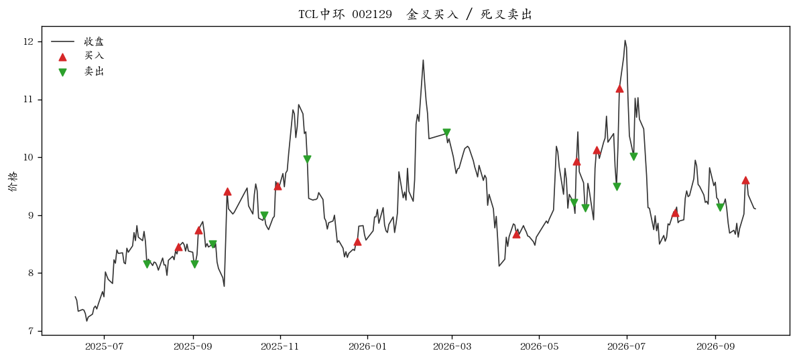

# 06 — 用 MACD 指标做简单交易系统

用 03 的 MACD 金叉和死叉做一套最小的买卖规则。一次只做一只股票，金叉把资金全部买进，死叉全部卖掉。

```bash
python3 trade.py
python3 trade.py sh600000
python3 trade.py sz002129 12 26 9
```

默认股票 `sz002129`，参数 12、26、9，和 03 相同。交叉的定义也在 `03-均线和MACD/macd.py` 的 `crosses()` 里，这里不再写一遍。

## 规则

| 信号 | 动作 | 成交价 |
|------|------|--------|
| DIF 上穿 DEA（金叉） | 空仓则全部买入 | 当天收盘价 |
| DIF 下穿 DEA（死叉） | 持仓则全部卖出 | 当天收盘价 |

已经持仓时再出现金叉，不重复买。空仓时出现死叉，没有可卖的股票。开始时如果 DIF 已经在 DEA 上面，也不追溯买入，只等下一次金叉。

前 `26 + 9 = 35` 根 K 线上的交叉不用。03 里说过，DEA 大约要 35 根之后才少受 EMA 起点影响。

不算手续费，也不把资金拆成多笔。卖出之后的资金全部留给下一次金叉。两笔交易之间是空仓，这段收益记为 0。

信号和买卖用的是同一个收盘价。图上能对齐，实盘在收盘那一刻通常来不及按这个价格成交。

## 和一直持有比

一直持有：从第 35 根的收盘价买入，拿到最后一根收盘价，中间不卖。

策略收益是各笔连着算的复利：期初资金记为 1，每次满仓进出之后剩下多少，最后减 1。期末如果还没遇到死叉，用最后一根收盘价给这笔未平仓估值，表里会标「未卖」，它还不是一笔已经结束的交易。

下面是 `python3 trade.py sz002129` 的买卖点。红三角是买入，绿三角是卖出。



## 这套规则没有做什么

没有仓位比例，没有止损，也没有用 RSI、KDJ 过滤。它只回答一件事：按 MACD 交叉进出，这段日 K 上留下哪些买卖，和一直拿着差多少。
